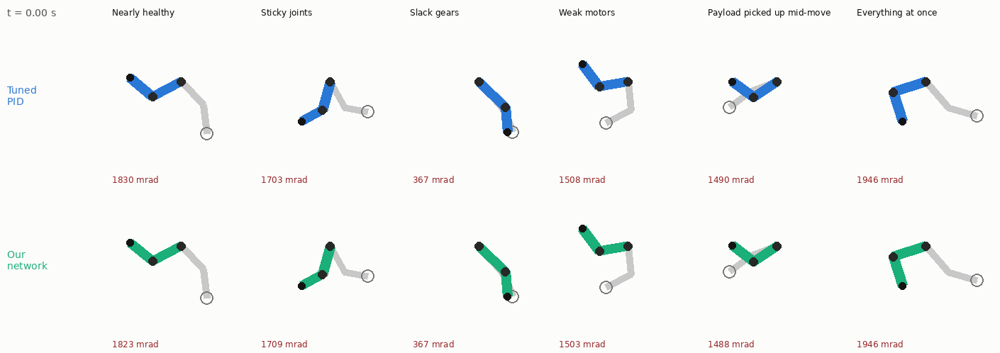
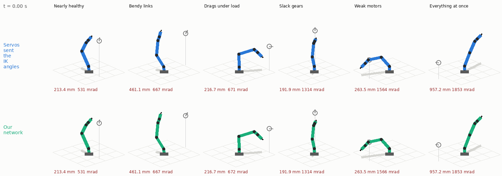
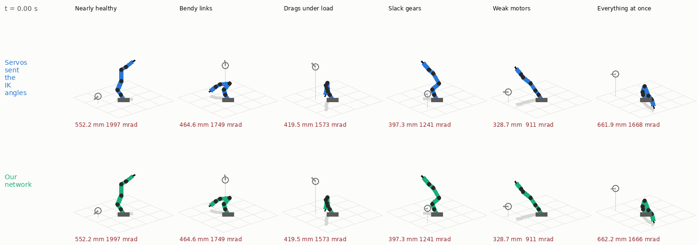
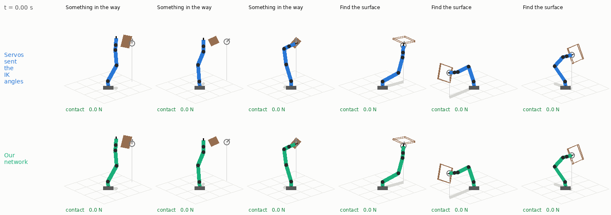
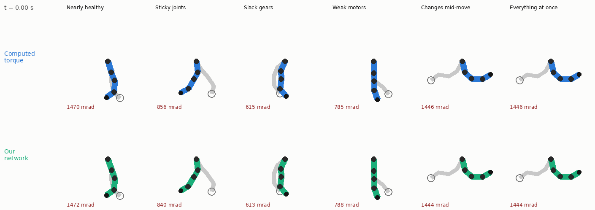

# One controller for many cheap, imperfect robot arms

Cheap arms are hard to drive well. Gears have slack, joints stick at some angles, motors are
weaker than rated, encoders are coarse and late, and everything changes when the arm picks
something up. A PID tuned for one arm is wrong for the next one, and wrong again a year later.

This project trains **one small neural network** that drives *any* such arm without being told
anything about it. It gets the encoder readings, the motor current, and where you want the
joints to go. From how the arm responds it works out, within a fraction of a second, what kind
of arm it is holding: how slack, how sticky, how weak, how late. Then it drives it accordingly.
Its memory is a vector of 384 numbers that we call the arm's **feeling**.



*Six arms from a held-out test set that the network never trained on, each driven by a PID with
carefully tuned gains (top) and by our network (bottom). The grey ghost is the pose the goal asks
for; green numbers are within tolerance.*

## What it does today

The arm is a two-joint planar arm in simulation, and the task is to reach commanded joint
angles and hold them. The simulator is the interesting part: it models thousands of *different*
arms at once, each with its own combination of

- slack in the gears (backlash), with a hidden rotor that has to cross the gap before the joint moves;
- dry friction that really sticks until the motor pushes hard enough, plus rubbing spots at particular angles;
- motors that are weaker than rated, respond slowly, and receive commands late;
- encoders with offset, noise, coarse steps, and delivery delay; a current sensor with its own errors;
- a payload picked up mid-move, a motor fading, or a joint fouling while the arm is moving;
- optionally, a neighbouring arm shoving it around.

It runs on a consumer GPU at about a billion simulated robot-steps per second, so the network
sees millions of different broken arms during training.

**Results on 4,096 held-out arms** (success = every joint within 30 mrad of its goal and at rest
for the last 0.3 s of a 3 s episode with a goal change in the middle):

| Arms | PID, gains tuned on these kinds of arms | **Our network** |
| --- | --- | --- |
| Healthy | 97.6% | **98.4%** |
| Defective | 25% | **83%** |
| Defective and changing mid-move | 22% | **83%** |
| ... and shoved by a neighbour (never trained on) | 13% | **52%** |

On defective arms the network's typical final error is 2.4 mrad; the PID's is 142 mrad. The
network also gets there about three times sooner. On a *healthy* arm it is exactly as precise as
the tuned PID (1.0 mrad against 1.1 mrad).

See [docs/REACH.md](docs/REACH.md) for the method, the full result tables, what helped and what
did not, and how to run everything; [docs/HANDOVER.md](docs/HANDOVER.md) for the state of the work,
the open multi-limb phase, and what to try next.

## Using the controller

The trained network is exported as **one C file that needs only `<math.h>`**: no framework, no
allocation, about 900k parameters (3.6 MB of float32 weights, 13 MB as source). Call it once
per 10 ms control tick:

```c
float feeling[384] = {0};      /* the network's memory of this arm; zero once at power-up */
float observation[12], command[2];
/* observation: measured angle/pi (2), estimated velocity/5 rad/s (2), motor current as a
   fraction of rated torque (2), goal angle/pi (2), goal - measured angle in rad (2),
   previous command (2) */
reach_policy_step(observation, feeling, command);
/* command: motor torque in [-1, 1] as a fraction of rated torque, per joint */
```

Nothing about the arm is configured. The file is checked in as [`export/reach_policy.c`](export/reach_policy.c)
and is regenerated from a training run with `python -m robot_ai.control.c_export`.

Caveats worth knowing before trying it on hardware: it is trained for a two-joint arm in a
vertical plane with torque-controlled motors and links of roughly 0.25 to 0.35 m and 0.3 to
0.7 kg; position-servo arms would need a different command interface. It has not been on a real
arm yet. The pushed condition (a neighbour moving the mount) is the weakest.

## How it is trained, in one paragraph

A first network is trained by reinforcement learning while being *told* the simulator's hidden
truth (the arm's real joint state and every defect parameter). It cannot be deployed, but it
learns what good control looks like on each kind of arm. A second network, which sees only what a
real controller sees, then drives the arms itself while the first one, watching the hidden truth
of the same moments, says what it would have done. The second network learns to reproduce that
from sensors alone. Along the way it also has to predict the arm's true state and hidden defects
from its own memory, which is what makes the memory a real "feeling" for the arm and, later, a
maintenance signal ("joint 2 is getting stiff around 0.4 rad").

## 3D arms with position servos: the arms people actually build

The arm here is a five-joint desktop arm: a base that turns, shoulder, elbow and wrist that pitch, and
a wrist roll. Its joints are **position servos**, like the Feetech servos of the SO-100/SO-101, a
Dynamixel, a hobby servo or a closed-loop stepper. You send each joint a target angle and the servo's
own fast loop tracks it. You tell the network where the gripper should be, which way it should point
and how it should be rolled. The network sends every servo a target, 100 times a second. The only
thing it is told about the arm is its link lengths.



*The six test arms that are worst in one respect each. Top: the usual approach, sending every servo the
joint angles computed from the goal (inverse kinematics). Proportional servos sag under load, so the
gripper typically ends 2–4 cm off. Bottom: our network, on the same arms. It learns how far each servo
has to be over-commanded against gravity, friction, slack and a sagging link, then holds still. It
misses the 5 mm target on the most compliant links (8.7 mm) and the heaviest load drag (6.3 mm); the
numbers are the final error.*

The simulator adds the defects that matter in 3D:
- joints that drag more when they carry more, so a turntable under an outstretched arm is stiffer than
  under a folded one;
- links that bend under their load, from both weight and acceleration;
- servos with different stiffness, a deadband, a 12-bit encoder that the computer reads over the bus,
  and a real motor behind them;
- everything listed above: slack, sticky spots, weak motors, late commands and readings, a payload
  picked up mid-move.

It agrees with MuJoCo to 2 mrad.

| Success: gripper within 5 mm and 30 mrad, arm at rest | Healthy arms | Moderately worn | Badly worn | Worst |
| --- | --- | --- | --- | --- |
| Servos sent the inverse-kinematics angles | 13% | 12% | 10% | 8% |
| **Our network** | **82%** | **83%** | **81%** | **60%** |

*Wear levels are defect severity 0, 0.25, 0.5 and 1. Each row is 4,096 test arms, with payloads,
fading motors and fouling joints appearing mid-move.*

Median final error is 1.5–2.2 mm up to badly worn arms and 3.8 mm on the worst.

The network runs with an **in-position hold**, as industrial motion controllers do. About a second after
each new goal it stops moving the servo targets, and it releases them as soon as the measured error
exceeds 5 mm (a picked-up payload, a push). Without it, the network keeps answering the one-count flicker
of the servo encoders, and the servos follow even that. The hold is worth 13 points on healthy arms.
What still fails on the worst arms is mostly servos hunting around their target on their own, as
LeRobot users know them to do on the SO-100 ("to avoid shakiness").

Driving the joints with torque instead, as a classical robotics controller would, is much worse on
these arms. A cheap arm's loop delay then sits inside the loop that holds the arm still. A controller
*told* every mass and motor strength reaches 1.4% on the worst arms, and a tuned PID 3%.
[docs/ARM3D.md](docs/ARM3D.md) has the details, including the dead ends.
[docs/RESEARCH_ACTION_SPACE.md](docs/RESEARCH_ACTION_SPACE.md) summarizes what real servos and related
work look like.

## The SO-101

The [SO-101](https://github.com/TheRobotStudio/SO-ARM100) is LeRobot's open desktop arm, built from Feetech STS3215
servos. It now exists in the simulator, taken from the official model
([so101_new_calib.urdf](https://github.com/TheRobotStudio/SO-ARM100/blob/main/Simulation/SO101/so101_new_calib.urdf)).
The simulated arm moves exactly like the URDF describes, agrees with MuJoCo to 2 mrad and 2 mm, and has the same
servos and defects as above.



*Six worn SO-101s. Top: the servos are sent the joint angles for the goal. Bottom: our network, trained on
SO-101s.*

| Success on SO-101s: gripper within 5 mm and 30 mrad, arm at rest | Healthy | Moderately worn | Badly worn | Worst |
| --- | --- | --- | --- | --- |
| Servos sent the inverse-kinematics angles | 20% | 17% | 15% | 11% |
| The desktop-arm network with its hold, never trained on an SO-101 | 55% | 51% | 42% | 22% |
| **The network after training on SO-101s** | **81%** | **87%** | **88%** | **73%** |

*4,096 test arms per column. Median final error 1.5–3.2 mm.*

## Obstacles: running into something, and feeling for a surface

The arm can now hit things: walls, boxes, posts, plates. It has no force sensor, so it can only feel a
contact through its motor currents and positions, like a real servo arm. The controller learns two new
things:
- **Something in the way.** An obstacle it was not told about blocks the path. It has to notice the
  blow, stop, back off, and stay off.
- **Find the surface.** It is told to move straight towards a surface whose exact position it does not
  know. It has to arrive gently and rest against it with a light force (0.5–10 N).

For this the network got one more output, a brake. The brake holds the arm where it is, or backs it off.



*Three arms with something in the way and three finding a surface (moderately worn); the number is the
contact force. Top: the servos are sent the joint angles for the goal and push on. Bottom: our network. It
backs off after a blow, and it reaches surfaces with a tenth of the force, but it does not always end in
the 0.5–10 N band. It rests at 0.3 N on the right, and it misses the plate on the left.*

| On 4,096 test arms (healthy / half worn / worst) | Servos sent the IK angles | Classical collision reflex | **Our network** |
| --- | --- | --- | --- |
| Something in the way: stopped and let go | 22% / 32% / 38% | 50% / 54% / 57% | **72% / 69% / 60%** |
| Pushing after the blow | 10.6 / 20.6 / 16.2 N s | 2.3 / 4.5 / 5.1 N s | **1.1 / 3.9 / 5.0 N s** |
| Found the surface: in the force band, at rest | 0% / 0% / 0% | 0% / 1% / 1% | **14% / 6% / 3%** |
| Hardest impact on the surface (median) | 28 / 190 / 415 N | 9 / 11 / 0 N | **7 / 16 / 82 N** |

The classical reflex is what industrial drives do: it detects a stall from following error and then backs off.
It stops blows, but it also brakes on ordinary moves whenever a worn servo stalls short of its target. Its
guarded approach to a surface rarely arrives at all. Touching a surface is the weakest skill so far. The network
learned it by imitating a scripted teacher that knows the true contact force, and the teacher itself succeeds
only 30% of the time on healthy arms. [docs/ARM3D.md](docs/ARM3D.md) has the details.

## Several limbs on top of each other (in progress, not solved)

Mount a second arm on the tip of the first and the two stop being independent: the lower arm carries
the upper one's weight and inertia, the upper one's gravity load depends on the lower one's pose, and
whenever either moves the other's mount accelerates under it. That is the next thing this project is
after, because it is what a real multi-limb machine does and because it is the honest test of whether
a "feeling" can be shared between limbs.



*The same six defective robots as above, but with a second arm mounted on the first. Computed torque
(top) is a classical controller that is **told** every true parameter of the robot; our network
(bottom) is told nothing. The network is several times closer to the goal, and still outside the
30 mrad tolerance — the numbers stay red where the single-arm ones went green.*

The simulator handles it: one kernel now does planar chains of any number of joints, validated
against MuJoCo, with every per-joint defect as before. The control is not there yet. On a four-joint
stacked chain the best network sits at about 90 mrad typical final error against the same 30 mrad
criterion the single arm meets at 2.4 mrad. A classical controller *told* every true parameter of the
robot manages 99.7% on healthy chains and 14% on defective ones, so the difficulty is real and not an
artefact of the learning setup.

Three things we have learned that are worth knowing before touching this:

* Reinforcement learning from scratch does not get off the ground on the chain, though the identical
  recipe works on a single arm. Seeding it with a classical controller does: that is what took the
  healthy-chain network to 76%.
* One network driving all four joints is much easier to train than one shared network per limb, even
  when each limb is allowed to see the other's sensors (76% against 11% on healthy chains). What a
  limb seems to need from its neighbour is not its measurements but its intent — where it is about to
  go. Testing that properly is the next experiment.
* Nothing fails because of one particular defect. Remove any single defect class and the chain result
  barely moves; it is the *variety* across the population that the chain policy has not yet absorbed.

[docs/MULTILIMB.md](docs/MULTILIMB.md) has the experiment design and the full list of what has been
tried; [docs/HANDOVER.md](docs/HANDOVER.md) has the current state and what to do next.

## Repository

| Path | What |
| --- | --- |
| `src/robot_ai/sim/joint_model.py`, `arm_batch.py` | The fused GPU simulator for two-joint arms (NVIDIA Warp) |
| `src/robot_ai/sim/chain_batch.py`, `chain_env.py` | The same for planar chains of any length: stacked limbs |
| `src/robot_ai/sim/population.py`, `reach_env.py` | Robot populations, mid-move changes, pushes; the reach task |
| `src/robot_ai/train/reach.py` | Training (PPO oracle, distillation), the tuned PID, the comparison report |
| `src/robot_ai/train/limbs.py` | One shared policy per limb, with optional sensing or messages between limbs |
| `src/robot_ai/control/computed_torque.py` | Classical controller with perfect knowledge, used to seed chain learning |
| `src/robot_ai/visualize/` | Comparison page, learning curves, animated replays |
| `src/robot_ai/control/c_export.py` | Export to a single C file |
| `src/robot_ai/sim/arm3d_batch.py`, `arm3d_env.py` | 3D arms: fused simulator (bending, load-dependent friction, position servos) and the tool-pose task |
| `src/robot_ai/control/pid3d.py`, `control/settle.py`, `visualize/animate3d.py` | The 3D PID baseline; the in-position hold; 3D replays |
| `src/robot_ai/sim/so101.py` | The SO-101, from its URDF |
| `src/robot_ai/control/reflex.py`, `control/contact_expert.py` | Classical collision reflex and guarded move; the scripted contact teacher |
| `docs/ARM3D.md`, `docs/RESEARCH_ACTION_SPACE.md` | The 3D phase; what real cheap arms accept |
| `docs/REACH.md` | Method, results, how to run |
| `docs/MULTILIMB.md`, `docs/HANDOVER.md` | The stacked-limb experiment; the state of the work and next steps |
| `docs/PROTOTYPE_README.md` and the other docs | The earlier imitation prototype, kept for history |

Setup and everything generated stay inside this directory; see [docs/LOCAL_SETUP.md](docs/LOCAL_SETUP.md).
More animations: `artifacts/reach/replays.html` (scrubbable replays) and `artifacts/reach/comparison-best.html`
(learning curves, result tables, joint-angle traces) are generated by the commands in docs/REACH.md.
The GPU used for all numbers above is a GeForce GTX 1650 (4 GB).

## What comes next

- Touching surfaces reliably, with a better teacher for the guarded approach, and contact on the SO-101.
- Stacked limbs, retried with the lessons from 3D. The servo interface, and a training step size that
  follows how far each update moves the network, are both likely to help there.
- A real SO-101. The simulator now models it and its servos, and the next step is to check the model against the
  real arm: log its servo positions and currents, and fit the servo model to them.
