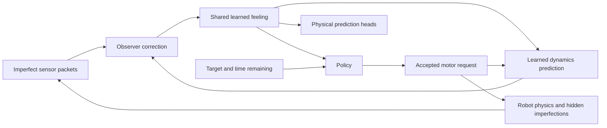

# Design guide

This specifies the first research prototype. Numeric defaults are engineering
starting points to validate, not measured capabilities. Use the separate
[simulation](SIMULATION.md), [evaluation](EVALUATION.md), and
[roadmap](ROADMAP.md) documents as contracts.

The [September 12 review](REVIEW.md) and [September 13 follow-up](REVIEW_2026-09-13.md)
found implementation departures from these contracts. Follow the current sequence
in ROADMAP. In particular, fresh does not
mean accurate, buffer length does not define task duration, and exported “best”
must refer to an evaluated selection. The healthy rigid path is the next useful
learning proof; downstream features remain required after their prerequisites.

## Objective and scope

The global goal is a reusable learned controller for **cheap, imperfect robots**:
work around backlash, bending, rubbing/scratching, wear, weak motors, and imperfect
observations while producing timely, accurate, smooth movement. The first arm is a
bounded experiment toward that goal, not a universal-robot claim.

Move the endpoint of a two-joint planar arm to a supplied position by deadline T.
Arrive with low velocity and remain within tolerance for a short hold interval.
Learn a recurrent feeling from measurements and previous commands. Use that same
feeling to predict motion and select actions. Adapt at evaluation with frozen
weights; only recurrent state changes.

Initial fixture: fixed base, vertical plane, two revolute joints, endpoint position,
numeric sensors, torque commands, one target per episode. Required later stages add
link compliance and a moving compliant base. Orientation, grasping,
obstacles, locomotion, variable joint count, vision, hardware, and online weight
updates are later extensions. Two-joint arms cannot choose arbitrary routes around
all forbidden angles; do not treat every failed task as a learning failure.

Priority order:

1. Stay within the declared operating constraints.
2. Meet the target/time/settling requirements.
3. Improve smoothness among controllers with comparable primary performance.

Operating constraints include structural loads on the base and links as well as
motor limits. Base force/moment/deflection remain relevant even for a motorized base.
See EVALUATION for the distinction between reduced-model load proxies and material
strain, and the primary-before-secondary training/checkpoint rules.



The loop advances according to the clock contract below; diagram edges do not imply
multiple observer updates during one control tick.

## Proposed package boundaries

```text
src/robot_ai/
  contracts.py        # public observations/actions/tasks; separate truth records
  config.py           # validated typed config, resolved config serialization
  sim/
    native.py         # MuJoCo backend
    actuators.py      # actuator and defect state updates
    sensors.py        # acquisition, bias, delay, sample-and-hold
    scenarios.py      # seeded episode construction and event schedules
    env.py            # batched task wrapper; reward/termination
    warp_backend.py   # primary GPU backend from P1
  baselines/
    kinematics.py     # analytic 2R forward/inverse kinematics
    controller.py     # trajectory + ordinary feedback baseline
  data/
    collect.py        # trajectories with reproducible provenance
    storage.py        # shards/manifests/checksums
    sequences.py      # recurrent burn-in and loss-window sampler
  models/
    observer.py       # measurement correction
    dynamics.py       # belief prediction under an action
    decoder.py        # physical-state prediction heads
    bundle.py         # serialization/version checks
  control/
    features.py       # frozen observer + public task features
    policy.py         # policy adapter, canonical inference interface
    runtime.py        # observe, act, reset state; no training labels
  train/
    world.py          # supervised prediction/estimation
    policy.py         # TorchRL PPO orchestration
  evaluate/
    metrics.py        # authoritative metric implementations
    suites.py         # immutable scenario lists
    report.py         # comparisons, uncertainty, plots
  visualize/
    replay.py         # synchronized controller comparisons
    viewer.html       # self-contained Canvas template
  cli.py
configs/
tests/
docs/
```

Create these incrementally. Do not build a plugin registry, general robotics SDK,
distributed scheduler, or abstract backend framework beyond the two known needs.

Dependency direction: contracts/config -> simulator/data/models -> training/control
-> evaluation/CLI. Runtime control must not import training, dataset writers, or
privileged simulator records. Models do not import MuJoCo.

## Public versus privileged information

Public information is realistically available to an eventual controller.

- `RobotDescriptor`: link lengths, nominal masses/inertias, nominal command torque
  scales, joint limits. Descriptor schema v1 has 12 values: 2 lengths, 2 nominal
  masses, 2 nominal inertias, 2 nominal torque scales, 4 joint-limit endpoints.
- `Observation`: sensor values plus availability/freshness/age metadata and time.
- `Task`: goal in a declared frame, deadline, tolerances, hold duration. Use world
  coordinates initially; the fixed base initially coincides with that frame.
- `Command`: two dimensionless numbers in [-1, 1], mapped to nominal motor torque.

At P8, descriptor schema v2 appends eight known operating-envelope values: maximum
base force magnitudes along x/z, maximum support moment, maximum base x/z/pitch
deflections relative to the support equilibrium, and two maximum link-flex angles.
This gives 20 descriptor values. Treat these as supplied ratings, not quantities
the robot can infer from ordinary motion. If ratings are fixed for a bundle they
remain explicitly recorded; varying ratings must be included in policy inputs.

Actual payload, motor effectiveness, friction, fault schedule, sensor bias/noise,
and true state belong in `PrivilegedRecord`. They may supply supervised targets,
reward, and evaluation, but never runtime inputs. Nominal descriptors must not
quietly become exact randomized dynamic parameters. Lengths are explicitly known
in the first experiment; uncertain length is a separately evaluated extension.

The latent vector has no named fault components. Supervision of predicted physical
outputs does not require supervision of the latent components.

## Observation contract v1

Eight numeric channels in this order:

1. Two measured output-joint angles.
2. Two velocity estimates derived from angle measurements.
3. Two measured motor-torque-equivalent signals, standing in for calibrated current.
4. Endpoint x and z measured by an independent tracker in the world frame.

For each channel provide `available`, `fresh`, and `age_s`. The three vectors have
eight entries each. Add elapsed time to the observation record. A timestamp or
validity flag must reflect what the real interface could report; it must not reveal
whether the reading is biased, lying, or physically stuck.

Availability/freshness/age are communication metadata, not an accuracy certificate.
A measurement residual connection may help optimization, but the observer must
remain able to correct a biased or frozen-new encoder even at zero age. Any ideal-
sensor bypass belongs to a separately identified healthy diagnostic condition.

Unavailable values use a finite placeholder plus mask. Preserve the last value for
sample-and-hold, with increasing age. Never pass NaNs into a network and hope it
learns to ignore them. Test actual frozen-but-newly-timestamped readings separately
from a detectable communication dropout.

Keep SI units in records: radians, radians/s, metres, seconds, N m. Normalize at the
model boundary using immutable training-split statistics and explicit scales.
Never compute normalization from validation/test data. Save feature order, units,
scales, clipping rules, masks, and schema versions in every inference bundle.

## Clock and recurrent-state contract

Default physics timestep is 0.001 s and control interval is 0.010 s, subject to
timestep-convergence tests. The neural model predicts one control interval per
transition. The observer runs once at each control tick, not once per physics step.

At reset: initialize actuator/sensor queues and latent state; acquire the initial
observation. Correct an initial zero belief using that observation. Do not invent
a previous physical transition. The previous-command feature is zero.

At time t:

1. Runtime has posterior belief `z_t` after processing observation `o_t`.
2. Policy selects `u_t` using `z_t`, public geometry, goal, time remaining, and
   previous requested command.
3. Boundary validates/clips requested command to the public interface. The exact
   accepted request is what the model records as `u_t`; hidden actuator loss is not
   exposed as the action.
4. Simulator advances all substeps, evolving actuator and sensor state.
5. At t+dt, predictor computes `z_prior = D(z_t, u_t, descriptor, dt)`.
6. Observer computes `z_next = O(z_prior, o_next, descriptor)` using only packets
   available by t+dt. This becomes `z_(t+1)`.

Sensor delay is modeled in the packet queues, not by misaligning actions and
training labels. The target for `u_t` is state at t+dt, not state at t.

Each vectorized environment has its own latent state, sensor queues, actuator state,
random streams, and episode identifier. Clear all of them on episode reset. A goal
change within a future multi-goal episode must not reset the physical feeling.

For TorchRL integration use explicit per-world resets. Score and store the terminal
observation before replacement by a reset observation. Do not rely on a collector's
undocumented default. Deadline plus hold is the task's natural termination; an
external debug step cap is truncation. Keep done/terminated/truncated distinct.
Test value bootstrapping against a tiny hand-computed rollout.

## First learned architecture

Use a deterministic recurrent predictor with observation correction. This is a
small project-specific baseline, not a claim to reproduce Dreamer.

- Belief `z`: 128 float32 values per robot.
- Observation encoder: two 128-wide SiLU layers over normalized values, masks,
  freshness, ages, and public descriptor.
- Observer: GRUCell, observation encoding as input, predicted belief as hidden state.
- Dynamics: separate GRUCell, input `[u_t, descriptor, dt]`, hidden state `z_t`.
- Decoder: 128-wide SiLU hidden layer to estimated q (2) and dq (2).
- Endpoint prediction at P5-P7: analytic forward kinematics of decoded q and known
  lengths, with velocity from the analytic Jacobian times decoded dq.
- At P8 add learned endpoint position/velocity residual heads (four additional
  outputs), added to nominal rigid FK/Jacobian predictions. These capture flex and
  base motion that q alone cannot represent. Train against world-frame truth; the
  residuals remain predictions, not privileged inputs. Use a new decoder/bundle
  schema and do not keep scoring flexible bodies using rigid FK.
- Policy: two 128-wide SiLU layers, mean and positive scale outputs for TorchRL's
  bounded TanhNormal distribution. Use its transformed log probabilities for PPO;
  never score a clipped action as an unbounded Gaussian. Document deterministic
  inference semantics and accepted-command recording.
- Critic: separate two-layer 128-wide MLP on the same public policy features.
  No privileged critic inputs initially.

One posterior belief feeds both decoder/predictor and policy. No independent
controller memory in the first adaptive policy; this makes the shared feeling
testable. Target/deadline are policy inputs, not physical-model inputs.

The posterior/transition distinction follows a broader recurrent-world-model idea;
[the TorchRL Dreamer description](https://docs.pytorch.org/rl/main/reference/dreamer_v3.html)
is a reference. Our deterministic baseline has no stochastic posterior, KL objective,
or calibrated uncertainty claim. Add uncertainty only under a separate design task.

## Training the feeling and predictor

First collect trajectory sequences using the ordinary feedback controller and
bounded exploratory commands. Split by robot/scenario before creating windows.

For each window:

1. Reconstruct the recurrent state from episode start when inexpensive. For sampled
   windows, use 32 control ticks of burn-in initially, then 64 loss ticks. Burn-in
   performs observation updates without retaining gradients; detach at the boundary.
2. Compute posterior state-estimation loss against simulator q/dq.
3. Predict one step without next-observation correction and compare decoded state
   against the next simulator state.
4. At selected anchors, roll the dynamics forward for 5 and 20 steps using recorded
   commands, with no observations or truth injected during that rollout.
5. Decode those predictions and compare with their matching true states.

Use Huber losses with fixed physical scaling, equal q/dq group weight initially.
Apply scales to prediction/target differences before Huber; dividing an already
computed Huber loss by a scale is a different objective and must not be confused
with normalized physical error. Keep evaluation metrics separate from training loss.
Use q scale pi radians and dq scale 5 rad/s initially. At P8 include endpoint
position/velocity groups with scales 0.55 m and 1 m/s and equal group weights;
record all scales. Tune only on training/validation data.
Initial total weights: posterior estimation 1, one-step prediction 1, five-step 0.5,
twenty-step 0.25. Log each physical-unit error separately. Optimize encoder,
observer, dynamics, and decoder together. No latent-only self-prediction objective
is sufficient: a constant feeling would satisfy it without learning physics.

Starter optimizer: Adam, learning rate 3e-4, gradient norm cap 1, sequence batch 16.
Choose anchors every 8 loss ticks to bound memory. Unroll only where the complete
future lies in the same episode and loss window. Start with 2,000 update steps,
then decide from validation curves; do not launch an unbounded training run.

Burn-in length is a tuning parameter, not a promise to remember persistent faults.
At evaluation run the entire episode continuously. If sampled-window training loses
long-lived information, compare 32 versus 128 burn-in ticks and full short episodes.
Do not initialize every training window to zero and report it as continuous memory.

Noise and bias parameters are not supplied to the observer. Clean simulator state
is used only as the training target. Compare performance with both realistic and
unobservable sensor suites; the latter can have an irreducible absolute error.

## Stored data and GPU batch contracts

An episode with N actions has N+1 observations and physical target states. Use
numeric, non-object `.npy` arrays with a JSON manifest; prohibit pickle-based array
payloads. One shard may contain several episodes with explicit offsets. The manifest
records shapes, dtypes, sensor/descriptor schemas, split IDs, and content hashes.

Required logical arrays for an episode:

| Field | Shape / meaning |
| --- | --- |
| `observation_values` | [N+1, C], C=8 for v1, C=14 with v2 base channels |
| `available`, `fresh`, `age_s` | [N+1, C] each, with bool/bool/float types |
| `time_s` | [N+1], acquisition metadata retained separately where needed |
| `accepted_action` | [N, 2], requested command after public boundary validation |
| `true_q`, `true_dq` | [N+1, 2], labels only |
| `true_endpoint`, `true_endpoint_velocity` | [N+1, 2], labels only |
| `terminated`, `truncated` | [N], distinguish natural end from external interruption |
| `substep_summary` | [N, K], declared extrema/violations needed for exact scoring |
| `descriptor`, `task` | Per-episode typed metadata, including coordinate frame |

Store internal actuator/flex/base truth and body transforms for selected diagnostic
replays. Store enough substep data or exact online summaries to reproduce the scorer;
control-rate endpoint samples alone cannot prove a no-overshoot hold interval.
If an episode ends before T on violation, deadline metrics are marked unavailable
and failure reason explicit; do not fabricate a state at T.

The TorchRL adapter uses fixed batch shape [B] with TensorDict keys for public
`observation`, `action`, and `next` observation/reward/done/terminated/truncated.
The policy's observation is the versioned feature vector below. Raw public sensors
remain available to the feature adapter, but truth is held in a disjoint evaluation
record. Assert keys/shape/device with TorchRL's spec checker for the pinned version.

Rollout tensors use a declared [B, time, feature] layout, with explicit time dimension
passed to advantage estimation. Preserve old log probabilities and critic values.
Use no-grad collection and detach stored features; do not retain recurrent graphs
across PPO rollouts. Clone shared Warp views before storing them in a persistent
buffer: otherwise the next physics step can overwrite the entire recorded past.

The collector stores the terminal next observation/value before resetting just the
ended worlds. `done` cuts sequence recursion; `terminated` cuts value bootstrap;
true truncations may bootstrap from their terminal observation, never the reset
observation. A rollout-buffer boundary alone is not environment termination.
P1/P6 must test these cases on a hand-computed tiny return sequence.

Use Warp kernels or batched PyTorch operations for actuator/sensor/reset updates.
Small shared control/substep loops in Python are acceptable; loops over worlds,
per-step `.item()` calls, or host observation conversion are not the GPU path.
Choose and document a stream handoff policy. Graph capture is a profiling-driven
optimization after correctness; reusable capture buffers must not break snapshots.

## Training the controller

Freeze the world-model bundle first, including normalization. A control feature
adapter advances the observer exactly once per actual environment transition.
For TorchRL, its policy observation is `[z_t, decode(z_t).q, decode(z_t).dq,
descriptor, goal_xz, goal_q, time_remaining, previous_command]`, with declared
normalization. `goal_q` is the positive-elbow inverse-kinematic solution derived
from the public endpoint task. This is 151 values for the v3 healthy-control feature schema. The
decoded state comes only from the frozen shared observer, never simulator truth.
The matched memoryless comparator is a separately trained feedforward policy over
current public sensor values, availability, freshness, ages, descriptor, goal,
time remaining, and previous accepted command. It has comparable capacity and
training budget, but no recurrent observer history. Give this interface its own
feature schema. Zeroing all 132 learned-state fields in the adaptive interface
removes every sensor input: retain that only as a sensor-removal diagnostic.
During the
hold interval time_remaining is zero; include the task's
fixed hold behavior in the environment contract, not a hidden change of objective.

Train with TorchRL PPO on actual simulator trajectories, not imagined states. Use
[TorchRL ClipPPOLoss](https://docs.pytorch.org/rl/stable/reference/generated/torchrl.objectives.ClipPPOLoss.html)
and [GAE](https://docs.pytorch.org/rl/stable/reference/generated/torchrl.objectives.value.GAE.html),
with a thin collector and minibatch loop checked against the
[official PPO tutorial](https://docs.pytorch.org/tutorials/intermediate/reinforcement_ppo.html)
for the pinned release. Simulator state, sensor queues,
belief, features, rollout buffers, and training tensors stay on CUDA. Host copies
are for bounded logging, dataset flushes, and selected replays, not per-world steps.

Starting PPO settings: 4 worlds (8 previously fit; 32 OOMed), 128 steps per rollout,
minibatch 256, 5 epochs,
learning rate 3e-4, `gamma=1.0`, `gae_lambda=0.95`, `clip_range=0.2`, entropy
coefficient 0, maximum gradient norm 0.5. These are finite, time-aware episodes.
Terminate at the natural task end; bootstrap only genuine truncations. Start with
100,000 transitions, evaluate, then permit a bounded extension to 500,000. P6/P7
define recovery rather than assuming those budgets guarantee success.

For the healthy baseline policy, use current public measurements/descriptor/task
features without learned feeling. For the adaptive policy, use the frozen belief.
Allow the baseline comparable parameter count. A later history-stacked baseline
checks whether simple history already suffices.

Prediction-only features might omit details useful to control. If the adaptive
policy cannot use them, use the diagnosis order in ROADMAP before adding networks.
Refreshing the world model requires a new bundle and policy compatibility version.
Do not fine-tune the observer while PPO rollout buffers still refer to its old
features. Initial refresh procedure: collect new data, retrain world model, discard
old PPO rollouts, recompute features, then retrain/retune policy as a new experiment.

## Runtime and artifacts

An inference bundle contains:

- Observer, dynamics, decoder, policy weights and architecture parameters.
- Observation/action/descriptor/task schema versions; normalization.
- Training configuration, dataset/split hashes, software versions, seeds.
- Supported robot family, timing, command meaning, sensor location assumptions.
- Evaluation report and known failure envelope.

Canonical runtime methods: `reset(descriptor, initial_observation, task)`,
`observe(accepted_previous_command, observation)`, `act(task)`, and
`predict(command_sequence)`. `act` does not update the belief. `predict` uses cloned
belief and cannot modify live state. Define return types in contracts before code.

Weights alone are insufficient. A permutation of sensor order or an incorrect
torque scale can invalidate a controller while leaving tensor shapes unchanged.
Bundle loading must reject mismatched versions, widths, feature order, or action
semantics. Latent coordinates are private to their matching bundle.

## Extension boundaries

- Vary dimensions within a fixed two-joint topology before adding joint-count changes.
- Add a three-joint planar arm for redundant-route/angle-avoidance studies.
- Add uncertain geometry only with measurements that can reveal it.
- Add learned-model planning only after multi-step prediction passes and a measured
  use case justifies the added runtime cost.
- Select real hardware before specifying its communication protocol or motor mode.
  Position-servo hardware cannot silently consume a torque-policy bundle.
- Safety supervision on hardware stays outside the learned policy. Its exact limits
  and stop behavior depend on the selected robot and are part of that later task.
